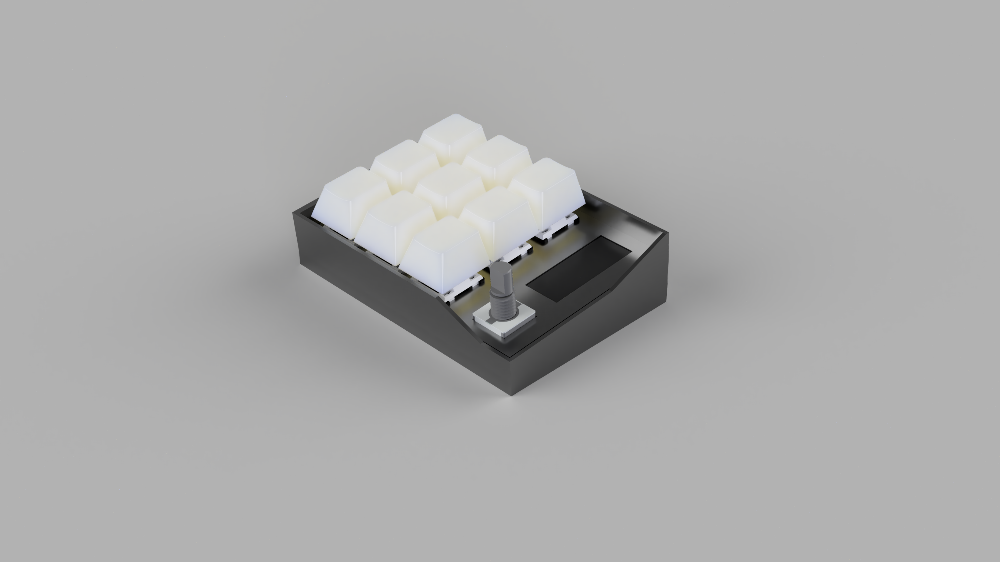
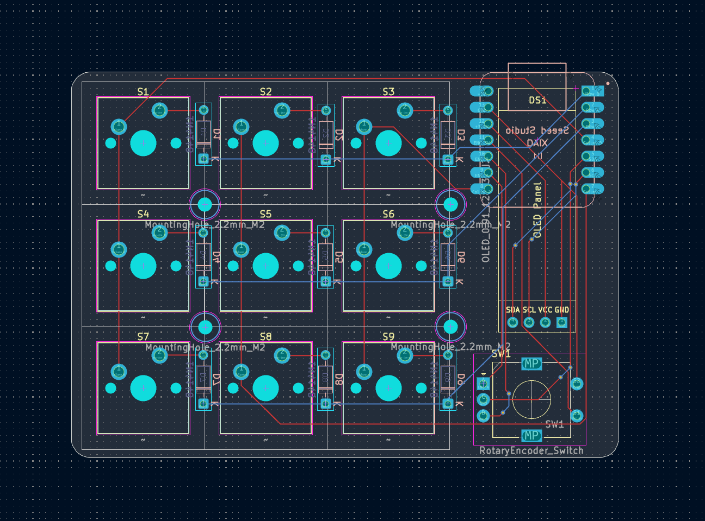
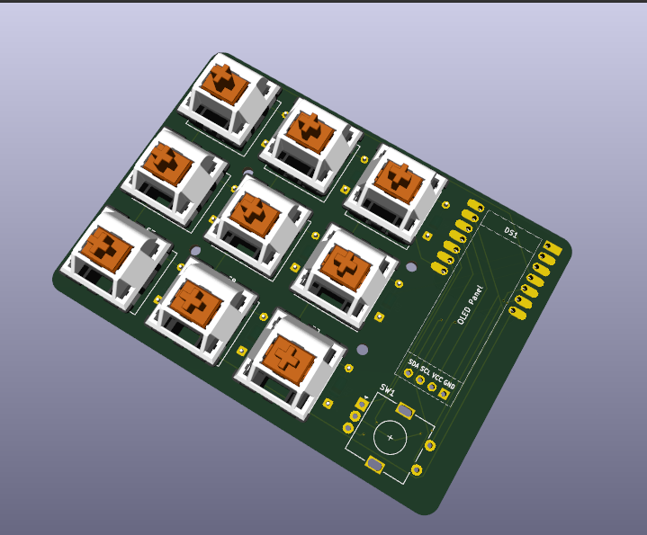
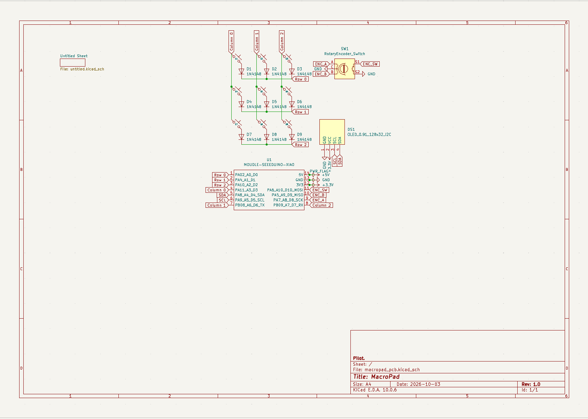

# Macropad; 9 keys, 1 encoder and an OLED
(first time making a readme for a macropad so bear with me <3)

### Hello yall! So this is the forth project which I posted on Stardance! (let's just ignore the other 3)
The first 3 were software projects, but this one (as you may or may not saw) its a hardware project! **Hardware > Software**
A macropad, who wouldn't want that? Plus you make it yourself AND get funded from our dear friends from Stardance! Now, who wouldn't what **THAT**.

As you saw (actually you didnt but let's ignore that), the Hackpad consists of 2 parts, the bottom part, the case itself and the top panel which makes it look prettier.

It has 9 switches, 1 encoder and an OLED, the case is very lovely in my opinion can't wait to 3D print it and the firmware is as basic as it gets basically, I will make it better as I finish the hardware and start using it.

Right now only 3 keys and the encoder are in use, the encoder for the volume and the 3 keys for media, the only things I NEED to have to be able to LIVE.

## Here's the PCB

## And the Schematic

##

What else can I say, it has a 3x3 matrix with diodes, uses almost all the parts from the Hackpad kit (doesn't use the LEDs, screws, heat inserts and the extra switches and keycaps) and I have the XIAO on the BACK of the board to minimise the area of the board, to make it as compact as I can.
The top panel uses M2 screws with I will supply them myself and the case uses M2 heat inserts, same idea.

## BOM

|          Part          | Qty |Price|Link|
|------------------------|-----|----|-----|
| Seeed XIAO RP2040      |  1  |$3.90/18.53 RON|https://www.seeedstudio.com/XIAO-RP2040-v1-0-p-5026.html
| MX-Style Switches      |  9  |~$2.70/~12.82 RON|https://www.divinikey.com/products gateron-ks-3-milky-yellow-pro-linear-switches
| White DSA Keycaps      |  9  |  White DSA Keycaps,9,~$5.35/~25.44 RON|https://www.adafruit.com/product/4998
| EC11E Encoder          |  1  |EC11E Encoder,1,$5.74/27.26 RON|https://www.digikey.com/en/products/detail/alps-alpine/EC11E1820402/21721574
| 0.91 inch OLED Display |  1  |0.91 inch OLED Display,1,$3.90/18.52 RON|https://www.displaymodule.com/products/0-91-inch-oled-graphic-display-128x32-with-i2c
| 1N4148 Diodes          |  9  |1N4148 Diodes,9,$0.90/ 4.27 RON|https://www.digikey.com/en/products/detail/onsemi/1N4148/458603
| M2 Screws              |  4  |
| M2 Heat Inserts        |  4  |
| 3D Printed Case        |  1  |
| 3D Printed Panel       |  1  |
